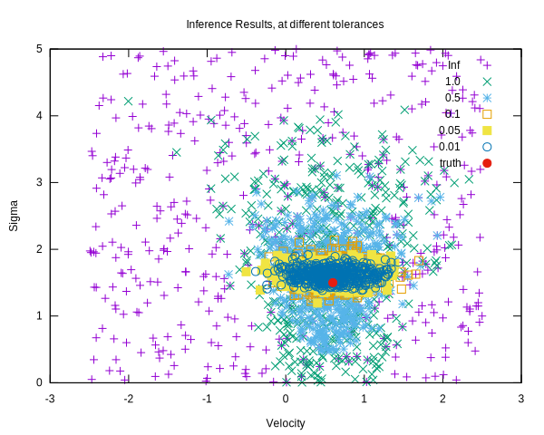

# fastABC
experimental repository for a c++ implementation of Approximate Bayesian Methods, stemming from the particle filtering literature.

# deps
must have GCC with C++ 17 support installed for running tests, and main application
must have gnuplot and texlive to build the plots.

## compile with
Open a terminal in main folder and
`chmod +x ./make.sh; ./make.sh`

## run tests with
Open a terminal in main folder and
`cd tests; chmod +x ./runtests.sh; ./runtests.sh`

## build plots with
Open a terminal in main folder and
`cd plot_infer; chmod +x ./buildplot.sh; ./buildplot.sh`

