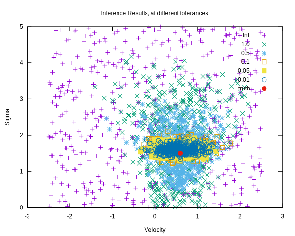

# fastABC
**Tests:** 

experimental repository for a c++ implementation of Approximate Bayesian Methods, stemming from the particle filtering literature.

# deps
must have GCC with C++ 17 support

## run tests with
Open a terminal in main folder and
`cd tests; chmod +x ./runtests.sh; ./runtests.sh`

## build plots with
Open a terminal in main folder and
`cd tests/plot_infer; chmod +x ./buildplot.sh; ./buildplot.sh`

